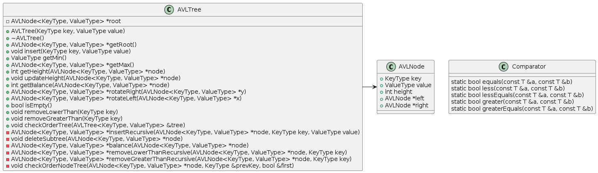
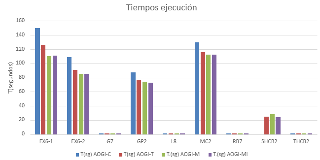

# Trabajo Final de Grado y Complemento 
<p align="center">
  
</p>

## Nomenclaturas:
- **AVL**: Árbol Binario de búsqueda balanceado.
- **AVL-T**: Árbol Binario de búsqueda balanceado con templates.
- **AOGI**: Algoritmo intervalar.
- **AOGI-M**: Algoritmo intervalar implementado con multiset. 
- **AOGI-MI**: Algoritmo intervalar implementado con multi_index.

## Directorios:
- TFG/AiBoBBwX-1.2: Versión del AVL-T.
- TFC/AiBoBBwX-1.2-M: Versión del AOGI con el uso de multiset.
- TFC/AiBoBBwX-1.2-MI: Versión del AOGI con el multi_index.

## AVL-T:
Versión C++ con templates para el almacenamiento en AVL ordenado por una clave (límite **inferior** de la función objetivo), donde cada nodo se almacenan los elementos. Para los elementos con la misma clave:
- En el código actual se almacenan en una lista FIFO.
- Se puede usar otro árbol binario ordenado por menor límite **superior** de la función objetivo.
- En caso de que haya dos elementos con los mismos dos límites se usa una lista.
- Acepta otros comparadores para almacenar cualquier tipo de clave.


<p align="center">
  
</p>

### Comparadores del AVL-T:

```cpp
template <typename T, typename Enable = void>
struct Comparator
{
    static bool equals(const T &a, const T &b)
    {
        return a == b;
    }
    static bool less(const T &a, const T &b)
    {
        return a < b;
    }
    static bool lessEquals(const T &a, const T &b)
    {
        return a <= b;
    }
    static bool greater(const T &a, const T &b)
    {
        return a > b;
    }
    static bool greaterEquals(const T &a, const T &b)
    {
        return a >= b;
    }
};

template <typename T>
struct Comparator<T, std::void_t<decltype(std::declval<T>().lower()), decltype(std::declval<T>().upper())>>
{
    static bool equals(const T &a, const T &b)
    {
        bool result = a.lower() == b.lower() && a.upper() == b.upper();
        return result;
    }

    static bool less(const T &a, const T &b)
    {
        bool result = (a.lower() < b.lower()) || (a.lower() == b.lower() && a.upper() < b.upper());
        return result;
    }

    static bool lessEquals(const T &a, const T &b)
    {
        bool result = less(a, b) || equals(a, b);
        return result;
    }

    static bool greater(const T &a, const T &b)
    {
        bool result = (a.lower() > b.lower()) || (a.lower() == b.lower() && a.upper() > b.upper());
        return result;
    }

    static bool greaterEquals(const T &a, const T &b)
    {
        bool result = greater(a, b) || equals(a, b);
        return result;
    }
};
```
### Métodos del AVL-T:
- `AVLTree(KeyType key, ValueType value)`: Constructor que inicializa el árbol con una clave y un valor especificados.
- `~AVLTree()`: Destructor que elimina el árbol.
- `AVLNode<KeyType, ValueType> *getRoot()`: Retorna el nodo raíz del árbol.
- `void insert(KeyType key, ValueType value)`: Inserta un nodo con la clave y valor especificados en el árbol.
- `ValueType getMin()`: Obtiene el valor mínimo del árbol.
- `AVLNode<KeyType, ValueType> *getMax()`: Obtiene el nodo con la clave máxima.
- `int getHeight(AVLNode<KeyType, ValueType> *node)`: Retorna la altura de un nodo.
- `void updateHeight(AVLNode<KeyType, ValueType> *node)`: Actualiza la altura de un nodo.
- `int getBalance(AVLNode<KeyType, ValueType> *node)`: Calcula el factor de balance de un nodo.
- `AVLNode<KeyType, ValueType> *rotateRight(AVLNode<KeyType, ValueType> *y)`: Realiza una rotación a la derecha en el nodo especificado.
- `AVLNode<KeyType, ValueType> *rotateLeft(AVLNode<KeyType, ValueType> *x)`: Realiza una rotación a la izquierda en el nodo especificado.
- `bool isEmpty()`: Verifica si el árbol está vacío.
- `void removeLowerThan(KeyType key)`: Elimina todos los nodos con claves menores a una clave especificada.
- `void removeGreaterThan(KeyType key)`: Elimina todos los nodos con claves mayores a una clave especificada.
- `void checkOrderTree(AVLTree<KeyType, ValueType> &tree)`: Verifica el orden del árbol.
## AOGI-M:
Implementación del AOGI con multiset, esta estructura permite adjuntar un comparador, nosotros hemos creado un comparador para la comparación.

### Características del multiset:
- **Duplicados permitidos**: Un multiset permite múltiples instancias del mismo elemento.
- **Frecuencia**: Cada elemento tiene una frecuencia asociada que indica cuántas veces aparece en el conjunto.
- **Asociativo y Ordenado**: Los elementos se almacenan de manera ordenada según un criterio específico, y se hace referencia a ellos por su clave.
- **Funciones clave**:
  - `insert(const value_type& val)`: Inserta un elemento en el multiset.
  - `erase(iterator position)`: Elimina el elemento en la posición especificada por el iterador.
  - `count(const value_type& val) const`: Retorna el número de elementos con el valor especificado.
  - `find(const value_type& val) const`: Retorna un iterador al primer elemento con el valor especificado.

## AOGI-MI:
Implementación del AOGI con multi_index. La estructura de datos multi_index permite crear contenedores con múltiples índices, ofreciendo una flexibilidad significativa en la organización y acceso a los datos. Esto permite definir múltiples formas de acceder y ordenar los elementos almacenados sin necesidad de duplicar el almacenamiento.

### Características del multi_index:
- **Índice Ordenado**: Clasifica los elementos de manera similar a `std::set`, permitiendo el ordenamiento por diferentes criterios.
- **Índice Secuencial**: Modelado según la semántica y la interfaz de `std::list`, organiza los elementos como si estuvieran en una lista bidireccional.
- **Índice Hashed**: Proporciona un acceso rápido a los elementos utilizando técnicas de hashing, similar a `std::unordered_set`.
- **Índice de Acceso Aleatorio**: Proporciona una interfaz similar a la de los índices secuenciales, pero con iteradores de acceso aleatorio y acceso posicional a los elementos.

### Implementación en AOGI-MI:
El uso de multi_index permite implementar el AOGI de manera que se pueda acceder y manipular los intervalos de las cajas a través de múltiples índices, optimizando el rendimiento y la flexibilidad en la manipulación de los datos.

## Tiempo de los diferentes algoritmos:
<p align="center">
  
</p>

## Observaciones para AVL-T:
- El elemento que se instancie en el template sea una clase que tenga sobrecargados algunos operadores, o sobrecargar el acceso a los métodos 'lower' y 'upper', ya que existe un comparador específico para intervalos.

## Salida gráfica con tk para la evaluación de las cajas:


## Necesitarás
1. **make**
2. **Compilador g++**
3. **tk** (para la salida gráfica)
4. **kv** (paquete C++ con Aritmética de Intervalos). Este usa:
   - **boost-devel**
5. **boost** (para el uso de multi_index)
